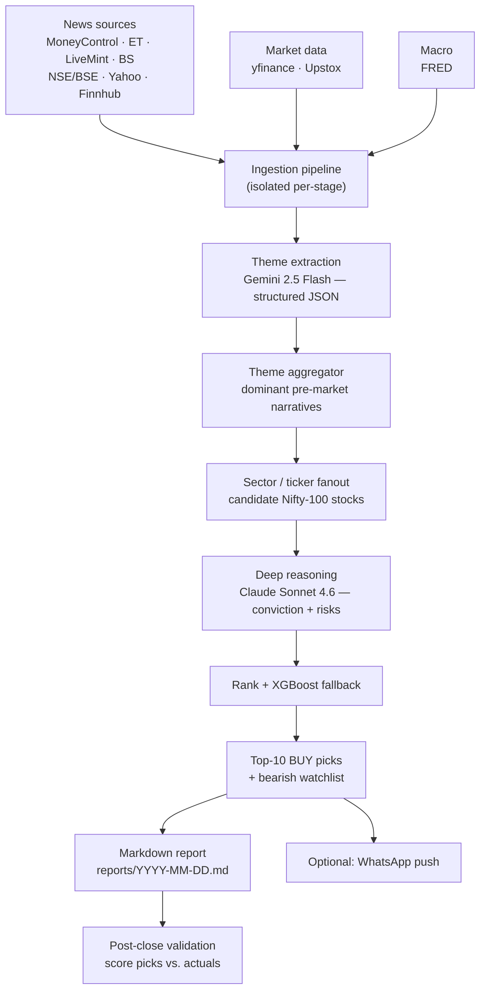

# Pre-Market Stock Prediction System

**An applied-LLM research pipeline that reads overnight Indian-market news, reasons about it with multiple language models, and produces a ranked, fully auditable list of Nifty-100 stocks to watch — every trading morning, locally, for pennies a day.**

> ⚠️ **Disclaimer — read this first.** This is a **personal, educational research project** built to explore applied-LLM reasoning pipelines. It is **NOT financial advice**, not a trading system, and not a recommendation to buy or sell any security. Nothing here is a solicitation or an offer. Markets are risky and model output is frequently wrong (see [Honest caveats](#honest-caveats)). Do your own research and consult a licensed financial advisor before making any investment decision. The author accepts no liability for any use of this code or its output.

---

## The problem

By the time a retail investor has read the overnight news — global markets, crude, rates, corporate announcements, sector chatter across a dozen sources — the trading day has already started. The information exists, but connecting *"this news"* → *"this theme"* → *"this sector"* → *"this specific stock"* is slow, subjective, and impossible to audit after the fact.

This project treats that as an **information-synthesis and reasoning problem**, not a price-prediction problem. Every morning it ingests the overnight news firehose, distills it into themes, reasons about which stocks each theme actually moves, and emits a short, explained watchlist — with the full chain of reasoning attached to every pick so the logic can be reviewed and scored against reality.

## What it does

Every trading morning (~8:00 AM IST), a single command runs an end-to-end pipeline that:

1. **Ingests** overnight news from MoneyControl, Economic Times, LiveMint, Business Standard, NSE/BSE announcements, Yahoo Finance and Finnhub, plus market OHLCV and FRED macro data.
2. **Extracts themes** from each new article with **Gemini 2.5 Flash** — structured JSON with a canonical theme key, market direction, magnitude, affected sectors and tickers, and a short rationale.
3. **Aggregates** those themes over the pre-market window into the day's dominant, ranked market narratives.
4. **Fans out** each theme to candidate Nifty-100 stocks, scoring by direct mention, sector alignment, liquidity, and technical momentum.
5. **Deep-reasons** over the top candidates with **Claude Sonnet 4.6** — a conviction score (1–10), the bull case, and key risks per stock.
6. **Ranks** and emits the **Top-10 BUY watchlist** plus a bearish "avoid" list, and writes a dated Markdown report at `reports/YYYY-MM-DD.md`.

An after-close command (`validate_today.py`) then logs actual price action and scores every pick — an honest feedback loop, not a demo.

## Key features

- **Auditable chain-of-reasoning** — every pick traces *news → theme → sector → stock → conviction*, persisted to a database so it can be reviewed and back-scored.
- **Multi-provider LLM routing for cost efficiency** — a cheap, fast model (Gemini Flash) handles high-volume theme extraction; an expensive, high-quality model (Claude) is reserved for deep reasoning on only the top candidates. Daily LLM spend is bounded (~₹10–14/day) with an explicit budget and a hard cap on reasoning calls.
- **Multi-source data ingestion** — 7+ news sources, market data (yfinance + Upstox broker API), and FRED macro indicators, with each ingestion stage isolated so one failure never aborts the run.
- **Deterministic ML fallback** — an XGBoost/LightGBM direction classifier and range regressors backstop the pipeline on quiet news days.
- **Honest validation harness** — predictions are scored against actual OHLCV; rolling 30-day accuracy is tracked and news-driven picks are compared head-to-head against the ML fallback.
- **Optional WhatsApp delivery** — a local Baileys daemon pushes the morning watchlist to your phone.
- **Fully local & config-driven** — runs on a laptop; every credential and toggle comes from `.env` (see [Setup](#setup)).

## Architecture



Plain-text view of the same flow:

```
News + market + macro ingest
        ↓
Gemini 2.5 Flash — theme extraction per article (structured JSON)
        ↓
Theme aggregator — dominant themes for the pre-market window
        ↓
Sector / ticker fanout — candidate stocks per theme
        ↓
Claude Sonnet 4.6 — deep reasoning + conviction per candidate
        ↓
Rank + XGBoost fallback (if too few bullish candidates)
        ↓
Top-10 BUY + bearish watchlist → Markdown report (+ optional WhatsApp)
        ↓
Post-close: validate every pick against actual OHLCV
```

## Tech stack

| Layer | Tools |
|-------|-------|
| **Applied LLMs** | Anthropic Claude (deep reasoning) · Google Gemini (bulk theme extraction) · multi-provider routing with per-call cost control |
| **Data ingestion** | `feedparser`, `requests`/`httpx`, `beautifulsoup4` (RSS + scraping) · `yfinance` · Upstox broker API · Finnhub · FRED |
| **ML fallback** | `scikit-learn`, `xgboost`, `lightgbm`, `ta` (walk-forward backtesting + P&L simulation) |
| **Data & storage** | `pandas`, `pyarrow` · MySQL via `SQLAlchemy` + `pymysql` |
| **App / tooling** | Python 3.11+, `uv`, `pydantic`, `tenacity`, `rich`, `structlog` |
| **Delivery** | Node.js Baileys WhatsApp daemon (optional) · macOS `launchd` scheduling |

The interesting engineering is in the **LLM orchestration**: structured-output extraction, routing volume work to a cheap model and reasoning work to an expensive one, hard budget/call caps, and turning free-text news into a persisted, auditable decision trail.

## Setup

**Requirements:** Python 3.11+, [`uv`](https://github.com/astral-sh/uv), and a MySQL server (e.g. via XAMPP). A Gemini and an Anthropic API key are required; other keys are optional.

```bash
# 1. Clone and enter the project
git clone <your-fork-url> stock-prediction-system
cd stock-prediction-system

# 2. Install dependencies
uv sync

# 3. Configure credentials — copy the template and fill in YOUR keys
cp .env.example .env
#   then edit .env:  GEMINI_API_KEY, ANTHROPIC_API_KEY (required),
#   FINNHUB_API_KEY / FRED_API_KEY / UPSTOX_* / DB_* (optional)

# 4. Verify the environment
.venv/bin/python test_setup.py     # expect all checks to pass
```

> 🔐 **Secrets never live in the repo.** All credentials load from `.env`, which is git-ignored. `.env.example` documents every variable with placeholder values only — start there.

## Running the daily pipeline

```bash
# Every trading morning (~8:00 AM IST) — the one command you run:
.venv/bin/python scripts/daily_run.py

# After market close — score today's picks against reality:
.venv/bin/python scripts/validate_today.py
```

Individual stages can be run on their own for debugging:

| Command | Purpose |
|---------|---------|
| `scripts/run_ingestion.py` | Refresh news / market / macro data only (no LLM calls) |
| `scripts/extract_themes.py` | Run Gemini theme extraction only |
| `scripts/predict_today.py` | Produce picks from existing themes only |
| `scripts/validate_by_source.py` | Compare news-driven vs. ML-fallback accuracy |
| `scripts/comprehensive_backtest.py` | Walk-forward backtest with simulated P&L |

### Example output

```
╭─ Daily Top-10 BUY (News-Driven) ─────────────────────╮
│ Target date: 2026-04-23 (Thursday)                   │
╰──────────────────────────────────────────────────────╯

Overnight themes:
  defense_spending_rise  bullish  strength 0.413  (5 articles)
  global_risk_on         bullish  strength 0.372  (8 articles)
  crude_oil_supply       bearish  strength 0.868  (52 articles)

Top 10 BUY for 2026-04-23:
  1  BEL         capital_goods        7/10 BUY     defense_spending_rise
  2  HAL         capital_goods        7/10 BUY     defense_spending_rise
  3  AXISBANK    banking_financial    6/10 BUY     global_risk_on
  ... +7 more

Bearish watchlist (avoid):
  ASIANPAINT, INDIGO, MARUTI, ONGC, RELIANCE (crude_oil_supply)
```

## Honest caveats

This project is deliberately transparent about its limits — that honesty is part of the design:

1. **Small-sample warning.** Any accuracy claim before 60+ trading days of live predictions is statistical noise.
2. **Theme alpha decays.** A correctly-identified theme is often already priced in — a high-conviction pick can still fall.
3. **Decision-support only.** The system produces a *watchlist with reasoning*. It never places trades and is not an autonomous trader.
4. **No performance guarantees.** Targets are aspirational; the validation harness exists precisely so real results, not hopes, have the final word.

## About this project

This is a **personal project** by Manish Goyal — a full-stack / AI engineer — built to explore applied-LLM reasoning pipelines: multi-provider orchestration, structured extraction, cost-bounded reasoning, and turning messy real-world text into an auditable, measurable decision trail. It runs entirely locally and is shared as a **portfolio piece**. It is **not a product, not a service, and not financial advice** (see the disclaimer at the top).

Deeper design docs live under [`docs/`](docs/) — architecture, database schema, requirements, and a decision log.
